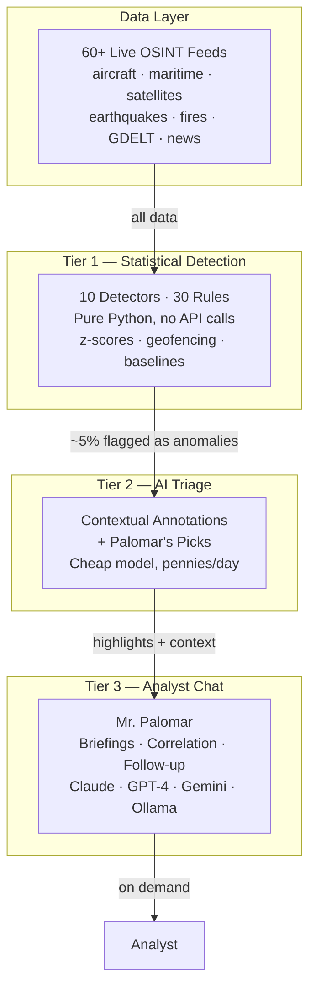

<div align="center">

<picture>
  <source media="(prefers-color-scheme: dark)" srcset="docs/logo-dark.svg">
  <source media="(prefers-color-scheme: light)" srcset="docs/logo-light.svg">
  
</picture>

# Palomar

**Real-time OSINT with an AI analyst. 60+ live feeds. One brain.**

> "It is only after you have come to know the surface of things that you can venture to seek what is underneath."
> — Italo Calvino, *Mr. Palomar*

[](LICENSE)
[](docker-compose.yml)
[](#quick-start)
[](https://docs.litellm.ai/docs/providers)
[](https://github.com/BigBodyCobain/Shadowbroker)

**I took the viral OSINT dashboard and gave it a brain.**

</div>

<br>

<div align="center">
  
  <p><i>Three-pane intelligence interface: anomaly sidebar, interactive globe, AI analyst chat</i></p>
</div>

---

## What does Palomar do?

Palomar watches 60+ real-time OSINT data feeds — aircraft, ships, satellites, earthquakes, fires, conflict zones, news, infrastructure — and layers an AI intelligence analyst on top.

Instead of staring at a map waiting to notice something, you get:

- **Anomaly detection** — 30 statistical rules across 10 domains flag what's unusual, with zero API calls
- **AI triage** — a cheap model annotates every anomaly and highlights what actually matters ("Palomar's Picks")
- **Conversational analyst** — ask "Brief me" or "What's happening near Taiwan?" and get a structured intelligence briefing

The AI layer is three tiers, designed so running the whole system costs pennies per day — or nothing at all with [Ollama](https://ollama.ai).

---

## In action

<table>
<tr>
<td width="50%">


*Severity-grouped anomalies with AI context annotations*

</td>
<td width="50%">


*AI-highlighted anomalies that warrant analyst attention*

</td>
</tr>
<tr>
<td width="50%">


*"Brief me" — structured intelligence briefings on demand*

</td>
<td width="50%">


*Deep dive: severity, AI analysis, coordinates, metadata*

</td>
</tr>
</table>

---

## Architecture

Palomar's AI layer is a three-tier filtering funnel. Each tier reduces noise so the next tier sees only what matters.



| Tier | What it does | Cost | Speed |
|------|-------------|------|-------|
| **Tier 1** | Statistical anomaly detection: z-scores, geofencing, rolling baselines | Free (pure Python) | Real-time (60s cycles) |
| **Tier 2** | AI triage: contextual annotations + "Palomar's Picks" highlights | Pennies/day or free with Ollama | Every 30 min (configurable) |
| **Tier 3** | Conversational analyst: briefings, cross-domain correlation, follow-up | On-demand per message | On demand |

---

## Detection rules

Tier 1 runs 30 statistical rules across 10 domains. No ML, no API calls — just math and rules over incoming data.

<details open>
<summary><b>Aircraft</b> — 10 rules</summary>

| Rule | Severity | What it detects |
|------|----------|----------------|
| Emergency squawk | CRITICAL | Squawk 7500 (hijack), 7600 (radio failure), 7700 (emergency) |
| Military concentration | MEDIUM+ | Unusual number of military aircraft in a grid cell |
| GPS jamming escalation | HIGH | Persistent high-severity GPS jamming zones |
| Unusual holding | MEDIUM | Military/tracked aircraft in holding pattern far from airports |
| Aircraft disappearance | HIGH | Military recon/cargo/tanker vanishes between cycles |
| Speed/altitude anomaly | MEDIUM | Impossible speed or altitude for the aircraft type |
| Unusual military type | MEDIUM | New military aircraft type appears in a region |
| Tanker/cargo surge | MEDIUM+ | Surge in military tanker or cargo aircraft |
| Tracked convergence | HIGH | Different-operator tracked aircraft converging (<30km) |
| UAV concentration | HIGH | Multiple UAVs in the same geographic area |

</details>

<details>
<summary><b>Maritime</b> — 3 rules</summary>

| Rule | Severity | What it detects |
|------|----------|----------------|
| Speed anomaly | MEDIUM | Vessel exceeding type-specific speed limit |
| Concentration | MEDIUM+ | Unusual vessel density in a grid cell |
| AIS gap | MEDIUM | Significant vessel missing from AIS between cycles |

</details>

<details>
<summary><b>Seismic</b> — 2 rules</summary>

| Rule | Severity | What it detects |
|------|----------|----------------|
| Earthquake swarm | MEDIUM | 3+ quakes in a grid cell within 24h |
| Unusual magnitude | HIGH+ | M6+ or exceeds regional baseline magnitude |

</details>

<details>
<summary><b>GDELT / News</b> — 4 rules</summary>

| Rule | Severity | What it detects |
|------|----------|----------------|
| Risk escalation | HIGH | News risk score spike above regional baseline |
| News surge | MEDIUM | Sudden increase in article volume for a region |
| Event density | MEDIUM | High concentration of geolocated conflict events |
| Risk acceleration | HIGH | Risk score increasing faster than normal |

</details>

<details>
<summary><b>Fires</b> — 4 rules</summary>

| Rule | Severity | What it detects |
|------|----------|----------------|
| Near nuclear plant | CRITICAL | Fire hotspot within 10km of nuclear facility |
| Near military base | HIGH | Fire hotspot within 10km of military installation |
| Cluster surge | MEDIUM+ | Fire hotspot count spike in a grid cell |
| Fire in conflict zone | HIGH | Active fire (FRP>30) in high-GDELT region |

</details>

<details>
<summary><b>Infrastructure, Cross-domain, Carriers, Conflict, Hotspot</b> — 6 rules</summary>

| Domain | Rule | What it detects |
|--------|------|----------------|
| Infrastructure | Geomagnetic storm | NOAA Kp index reaches storm threshold |
| Infrastructure | Internet outage | BGP/ping disruption severity above threshold |
| Cross-domain | Military + conflict | Military aircraft co-located with GDELT conflict reporting |
| Cross-domain | Outage + conflict | Infrastructure outage co-located with conflict zone |
| Carriers | Carrier repositioning | US Navy carrier moves >93km between cycles |
| Conflict | Incident surge | LiveUAMap incident count spike per region |
| Hotspot | Multi-domain hotspot | 3+ anomaly domains co-locating in same area |

</details>

---

## Data sources

All sources are public OSINT — no paid subscriptions required for the base dashboard.

| Category | Sources |
|----------|---------|
| Aviation | ADS-B (multiple providers with blind-spot gap-filling), OpenSky Network, tracked aircraft DB |
| Maritime | AIS vessel tracking, carrier position estimation, superyacht alerts |
| Satellites | SGP4/NORAD TLE real-time orbital propagation (18,000+ objects) |
| Earthquakes | USGS real-time seismic feed (M2.5+) |
| Fires | NASA FIRMS VIIRS thermal anomalies |
| Geopolitics | GDELT Project, LiveUAMap incident tracking |
| News | Configurable RSS feeds with automated risk scoring + geocoding |
| Infrastructure | Internet outages (IODA), data centers, military bases, nuclear plants |
| CCTV | London (TfL JamCam), Singapore (LTA), Austin TX, NYC DOT |
| Space weather | NOAA solar wind, geomagnetic Kp index |
| Financial | Defense sector stocks, oil prices |
| Radio | KiwiSDR monitoring network |
| Conflict | Ukraine frontlines (GeoJSON), incident tracking |
| Weather | Radar overlay (RainViewer) |

---

## Quick start

```bash
git clone https://github.com/dananmay/palomar.git
cd palomar
cp .env.example .env
docker compose up
```

Open [localhost:3000](http://localhost:3000). The dashboard works immediately with zero configuration — all feeds start populating the map and **Tier 1 anomaly detection runs out of the box** with no API keys, no models, no cost.

### Enable AI features

Add at least one model to `.env`:

```bash
# Option A: Cloud model (fast setup)
PALOMAR_TRIAGE_MODEL=gemini/gemini-2.0-flash        # Tier 2 — triage
PALOMAR_ANALYST_MODEL=anthropic/claude-sonnet-4-5    # Tier 3 — chat

# Option B: Fully local with Ollama (free, private)
PALOMAR_TRIAGE_MODEL=ollama/llama3.1
PALOMAR_ANALYST_MODEL=ollama/llama3.1
PALOMAR_OLLAMA_BASE_URL=http://host.docker.internal:11434
```

Then restart: `docker compose up`

### Run without Docker

```bash
# Terminal 1 — backend
cd backend
pip install -r requirements.txt
uvicorn main:app --host 0.0.0.0 --port 8000

# Terminal 2 — frontend
cd frontend
npm install && npm run dev
```

---

## Model configuration

All LLM calls go through [LiteLLM](https://docs.litellm.ai/docs/providers), so any provider works — or run fully local with Ollama.

| Variable | Purpose | Examples |
|----------|---------|----------|
| `PALOMAR_TRIAGE_MODEL` | Tier 2: cheap/fast model for triage | `gemini/gemini-2.0-flash`, `openai/gpt-4o-mini`, `ollama/llama3.1` |
| `PALOMAR_ANALYST_MODEL` | Tier 3: strong model for chat | `anthropic/claude-sonnet-4-5`, `openai/gpt-4o`, `ollama/llama3.1` |
| `PALOMAR_TRIAGE_INTERVAL_MINUTES` | Triage frequency (default: 30) | `15`, `30`, `60` |
| `PALOMAR_OLLAMA_BASE_URL` | Ollama endpoint | `http://localhost:11434` |

API keys follow LiteLLM conventions: `OPENAI_API_KEY`, `ANTHROPIC_API_KEY`, `GEMINI_API_KEY`, etc.

<details>
<summary>Running fully local with Ollama</summary>

1. [Install Ollama](https://ollama.ai)
2. Pull a model: `ollama pull llama3.1`
3. Add to `.env`:
   ```
   PALOMAR_TRIAGE_MODEL=ollama/llama3.1
   PALOMAR_ANALYST_MODEL=ollama/llama3.1
   PALOMAR_OLLAMA_BASE_URL=http://host.docker.internal:11434
   ```
4. `docker compose up`

The triage prompt is designed to work on models as small as 7B parameters.

</details>

---

## Tech stack

| Layer | Technology |
|-------|-----------|
| Frontend | Next.js 16, React 19, MapLibre GL JS, Tailwind CSS 4, Framer Motion |
| Backend | FastAPI, Python |
| AI | LiteLLM (model-agnostic) — OpenAI, Anthropic, Google, Ollama, and more |
| Deploy | Docker Compose, self-hosted |

---

## What Palomar adds to Shadowbroker

[Shadowbroker](https://github.com/BigBodyCobain/Shadowbroker) is a brilliant dashboard — it shows you everything but tells you nothing. Palomar adds the analytical brain.

| | Shadowbroker | Palomar |
|---|---|---|
| Live OSINT feeds | 60+ | 60+ (inherited) |
| Anomaly detection | — | 30 rules, 10 domains |
| AI triage | — | Contextual annotations + highlights |
| Conversational AI | — | "Mr. Palomar" analyst chat |
| Cost to run AI | — | Free (Ollama) to pennies/day |
| Self-hosted | Yes | Yes |

---

## Contributing

Contributions welcome. The most impactful areas:

- **New detection rules** — add a detector in `backend/anomaly/detectors/` following existing patterns
- **New data sources** — extend the fetcher pipeline in `backend/services/fetchers/`
- **Frontend improvements** — the UI is in `frontend/src/`
- **Prompt engineering** — all prompts live in `prompts/*.md` and reload at runtime (no restart needed)

See [`CLAUDE.md`](CLAUDE.md) for a detailed architecture guide.

---

## License

AGPL-3.0 — inherited from [Shadowbroker](https://github.com/BigBodyCobain/Shadowbroker). See [LICENSE](LICENSE).

## Credits

- [Shadowbroker](https://github.com/BigBodyCobain/Shadowbroker) by [@BigBodyCobain](https://github.com/BigBodyCobain) — the original OSINT dashboard
- [LiteLLM](https://github.com/BerriAI/litellm) — model-agnostic LLM gateway
- [MapLibre GL JS](https://maplibre.org/) — open-source map rendering

## Why "Palomar"?

Named after [*Mr. Palomar*](https://en.wikipedia.org/wiki/Mr._Palomar) by Italo Calvino — a man whose chief activity is observing the world with extreme precision and finding patterns in what he sees. Also a nod to the [Palomar Observatory](https://en.wikipedia.org/wiki/Palomar_Observatory), which for decades was humanity's most powerful eye on the sky.
