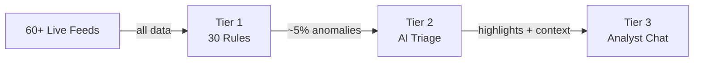

<div align="center">

<picture>
  <source media="(prefers-color-scheme: dark)" srcset="docs/logo-dark.svg">
  <source media="(prefers-color-scheme: light)" srcset="docs/logo-light.svg">
  
</picture>

# Palomar

**Real-time OSINT with an AI analyst. 60+ live feeds. One brain.**

> *"It is only after you have come to know the surface of things<br>that you can venture to seek what is underneath."*
> — Italo Calvino, *Mr. Palomar*

[](LICENSE)
[](docker-compose.yml)
[](#quick-start)
[](https://docs.litellm.ai/docs/providers)
[](https://github.com/BigBodyCobain/Shadowbroker)

</div>

<br>

<div align="center">
  
</div>

<br>

I took the [viral OSINT dashboard](https://github.com/BigBodyCobain/Shadowbroker) and gave it a brain. Palomar watches 60+ live data feeds — aircraft, ships, satellites, earthquakes, fires, conflict zones, news — and layers a three-tier AI analyst on top. Instead of staring at a map waiting to notice something, you get anomaly detection, contextual triage, and a conversational intelligence briefing.

The whole AI layer costs pennies per day — or nothing at all with [Ollama](https://ollama.ai).

---

## Quick start

```bash
git clone https://github.com/dananmay/palomar.git
cd palomar
cp .env.example .env
docker compose up
```

Open [localhost:3000](http://localhost:3000). All 60+ feeds populate immediately. Anomaly detection runs out of the box — no API keys, no models, no cost.

<details>
<summary><b>Enable AI features</b></summary>

<br>

Add a model to `.env` and restart:

```bash
# Cloud (fast setup)
PALOMAR_TRIAGE_MODEL=gemini/gemini-2.0-flash
PALOMAR_ANALYST_MODEL=anthropic/claude-sonnet-4-5

# — or fully local with Ollama (free, private) —
PALOMAR_TRIAGE_MODEL=ollama/llama3.1
PALOMAR_ANALYST_MODEL=ollama/llama3.1
PALOMAR_OLLAMA_BASE_URL=http://host.docker.internal:11434
```

All LLM calls go through [LiteLLM](https://docs.litellm.ai/docs/providers) — any provider works. The triage prompt runs on models as small as 7B.

</details>

<details>
<summary><b>Run without Docker</b></summary>

<br>

```bash
# Terminal 1
cd backend && pip install -r requirements.txt && uvicorn main:app --host 0.0.0.0 --port 8000

# Terminal 2
cd frontend && npm install && npm run dev
```

</details>

---

## How it works

<table>
<tr>
<td width="33%" valign="top">

### Tier 1 — Detection

30 statistical rules across 10 domains. Pure Python, no API calls, real-time.

Emergency squawks, military aircraft surges, vessel AIS gaps, earthquake swarms, fires near nuclear plants, internet outages, cross-domain hotspots, and more.

**Cost:** Free — always on.

</td>
<td width="33%" valign="top">

### Tier 2 — AI Triage

A cheap model annotates every anomaly with context and selects "Palomar's Picks" — the ones that genuinely warrant attention.

Runs every 30 minutes (configurable). Batch-processes anomalies with regional news context.

**Cost:** Pennies/day, or free with Ollama.

</td>
<td width="33%" valign="top">

### Tier 3 — Analyst Chat

Ask *"Brief me"* or *"What's happening near Taiwan?"* and get a structured intelligence briefing with cross-domain correlation.

The chat receives a live state snapshot every message — anomalies, triage results, news, your map selection.

**Cost:** On-demand per message.

</td>
</tr>
</table>



---

## In action

<table>
<tr>
<td width="50%">


*Severity-grouped anomalies with AI annotations*

</td>
<td width="50%">


*AI-highlighted anomalies that warrant attention*

</td>
</tr>
<tr>
<td width="50%">


*Structured intelligence briefings on demand*

</td>
<td width="50%">


*Deep dive with AI analysis and metadata*

</td>
</tr>
</table>

---

## What it watches

Aviation (ADS-B, OpenSky) · Maritime (AIS, carrier tracking) · Satellites (18,000+ objects, SGP4) · Earthquakes (USGS) · Fires (NASA FIRMS) · Geopolitics (GDELT, LiveUAMap) · News (RSS + risk scoring) · Infrastructure (internet outages, military bases, nuclear plants) · CCTV (London, Singapore, Austin, NYC) · Space Weather (NOAA) · Defense Stocks · Radio (KiwiSDR) · Conflict Zones · Weather Radar

All public OSINT — no paid subscriptions required.

---

## What Palomar adds to Shadowbroker

[Shadowbroker](https://github.com/BigBodyCobain/Shadowbroker) shows you everything but tells you nothing. Palomar adds the brain.

| | Shadowbroker | Palomar |
|---|---|---|
| Live OSINT feeds | 60+ | 60+ (inherited) |
| Anomaly detection | — | 30 rules, 10 domains |
| AI triage | — | Contextual annotations + highlights |
| Conversational AI | — | "Mr. Palomar" analyst chat |
| Cost to run AI | — | Free (Ollama) to pennies/day |

---

## Configuration

<details>
<summary><b>Environment variables</b></summary>

<br>

| Variable | Purpose | Examples |
|----------|---------|----------|
| `PALOMAR_TRIAGE_MODEL` | Tier 2: cheap/fast triage model | `gemini/gemini-2.0-flash`, `openai/gpt-4o-mini`, `ollama/llama3.1` |
| `PALOMAR_ANALYST_MODEL` | Tier 3: strong analyst model | `anthropic/claude-sonnet-4-5`, `openai/gpt-4o`, `ollama/llama3.1` |
| `PALOMAR_TRIAGE_INTERVAL_MINUTES` | Triage frequency (default: 30) | `15`, `30`, `60` |
| `PALOMAR_OLLAMA_BASE_URL` | Ollama endpoint | `http://localhost:11434` |

API keys follow LiteLLM conventions: `OPENAI_API_KEY`, `ANTHROPIC_API_KEY`, `GEMINI_API_KEY`, etc.

</details>

<details>
<summary><b>Tech stack</b></summary>

<br>

| Layer | Technology |
|-------|-----------|
| Frontend | Next.js 16, React 19, MapLibre GL JS, Tailwind CSS 4, Framer Motion |
| Backend | FastAPI, Python |
| AI | LiteLLM (model-agnostic) — OpenAI, Anthropic, Google, Ollama, and more |
| Deploy | Docker Compose, self-hosted |

</details>

<details>
<summary><b>Detection rules (30 rules, 10 domains)</b></summary>

<br>

**Aircraft** (10 rules) — Emergency squawks (7500/7600/7700), military concentration, GPS jamming escalation, unusual holding patterns, aircraft disappearance, speed/altitude anomalies, unusual military types, tanker/cargo surges, tracked convergence, UAV concentration

**Maritime** (3) — Speed anomalies, vessel concentration, AIS gaps

**Seismic** (2) — Earthquake swarms, unusual magnitude

**GDELT / News** (4) — Risk escalation, news surges, event density, risk acceleration

**Fires** (4) — Near nuclear plants, near military bases, cluster surges, fires in conflict zones

**Infrastructure** (2) — Geomagnetic storms, internet outages

**Cross-domain** (2) — Military + conflict co-location, outage + conflict co-location

**Carriers** (1) — Carrier repositioning (>93km between cycles)

**Conflict** (1) — LiveUAMap incident surges

**Hotspot** (1) — Multi-domain co-location (3+ domains in same area)

</details>

---

## Contributing

Contributions welcome. See [`CLAUDE.md`](CLAUDE.md) for full architecture docs.

- **New detection rules** — `backend/anomaly/detectors/`
- **New data sources** — `backend/services/fetchers/`
- **Prompt engineering** — `prompts/*.md` (reloads at runtime, no restart)
- **Frontend** — `frontend/src/`

---

## License

AGPL-3.0 — inherited from [Shadowbroker](https://github.com/BigBodyCobain/Shadowbroker). See [LICENSE](LICENSE).

## Credits

[Shadowbroker](https://github.com/BigBodyCobain/Shadowbroker) by [@BigBodyCobain](https://github.com/BigBodyCobain) · [LiteLLM](https://github.com/BerriAI/litellm) · [MapLibre GL JS](https://maplibre.org/)

Named after [*Mr. Palomar*](https://en.wikipedia.org/wiki/Mr._Palomar) by Italo Calvino and the [Palomar Observatory](https://en.wikipedia.org/wiki/Palomar_Observatory) — precise observation, pattern recognition, understanding.
